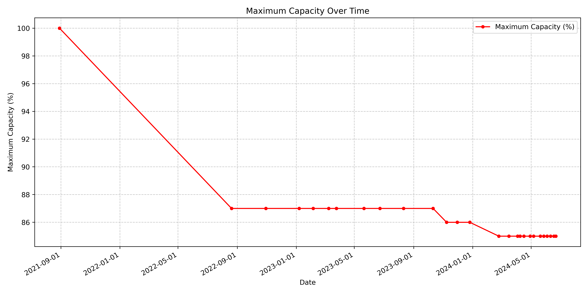
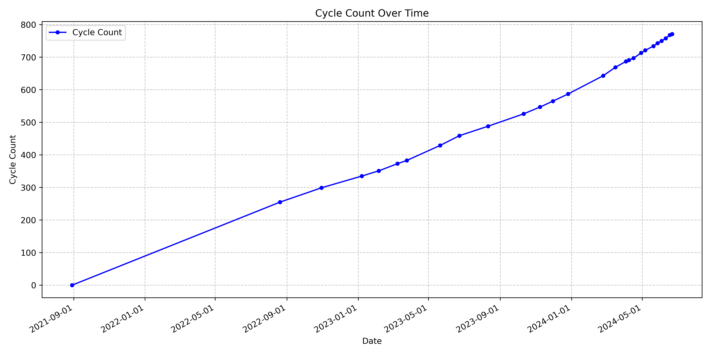

# MacOS Battery Tracker

This program automatically tracks the health of your MacBook's battery over time. It records the cycle count and maximum
capacity of your battery and stores this data in a CSV file. The program also generates plots to visualize these metrics
over time.
Instead of doing this manually, by going into the system report and checking the battery health, which is a tedious
task, this program automates the process and provides a convenient way to monitor your battery
health over time.

## Features

- Tracks battery cycle count and maximum capacity
- Stores data in a CSV file
- Generates plots for visualizing battery health over time

## Example

This is an example of the plots generated by the program from my personal machine:



## Usage

1. Clone this repository to your local machine:
2. Change the exectuable permission of the script:
    ```bash
    chmod +x battery_tracker.sh
    ```
3. Run the script:
    ```bash
    ./battery_tracker.sh
    ```

## Automation

This scipt can be automated to run at regular intervals using `cron` jobs.

This can be done by running ```automate.sh``` script. This script will add a cron job to run
the ```battery_tracker.sh``` on Mondays at 12:00 PM.

1. Open the terminal and navigate to the project directory.
2. Run the `automate.sh` script:

```bash
  chmod +x automate.sh
  ./automate.sh
```

You can change the cron job settings by modifying the `automate.sh`
file or by manually adding a cron job, which is described below.

### Manual Cron Job

To do this, follow these steps:

1. Open the terminal and navigate to the project directory.

2. Change the `battery_tracker.sh` file to an executable, if you haven't already done so:
    ```bash
    chmod +x battery_tracker.sh
    ```
3. Open the crontab file:
    ```bash
    crontab -e
    ```
   By default this will open the crontab file in the `vim` editor. If you are not familiar with `vim`, you can change
   the default editor by running:
    ```bash
    export EDITOR=nano
    ```
   Then open the crontab file again using `crontab -e`.
4. Add the following line to the file:
    ```bash
    0 12 * * 1 /path/to/battery_tracker.sh
    ```
   This will run the script every Monday at 12:00 PM. Check the [Cron Job Syntax](https://crontab.guru/) for more
   options.
5. Save and exit the file.
6. Check if the cron job was added successfully:
    ```bash
    crontab -l
    ```
7. You can also check the logs to see if the script is running successfully:
    ```bash
    grep CRON /var/log/syslog
    ```
   This will show the logs for the cron jobs.

## License

This project is licensed under the MIT License. See the `LICENSE` file for more details.